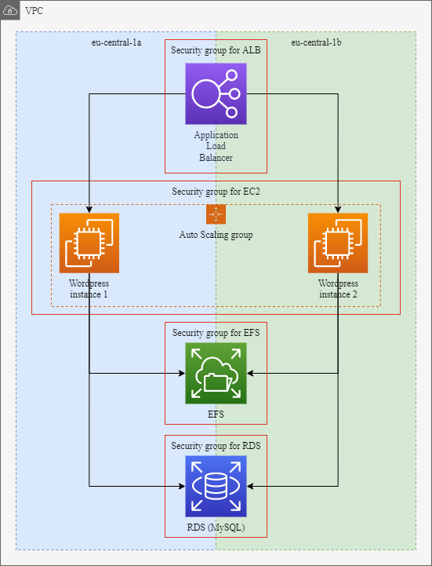

# EPAM AWS Practice Task

Solution done using terraform, bash, wp cli utility and [GitHub Actions](https://github.com/sorquan/aws-task/actions).

Input data (Actions reposotory secrets):
* AWS_ACCESS_KEY (Runner access key)
* AWS_SECRET_KEY (Runner secret key)
* AWS_KEY_PAIR (Public SSH key for access EC2 instances)
* WP_ADMIN_EMAIL (Wordpress admin email)
* WP_ADMIN_NAME (Wordpress admin name)
* WP_ADMIN_PASS (Wordpress admin pass)
* WP_DB_NAME (RDS MySQL database name for Wordpress)
* WP_DB_USER (RDS MySQL user name for Wordpress)
* WP_DB_PASS (RDS MySQL user password for wordpress)

Output data:
* ALB public DNS address for access site

Used in project:
* 1 x VPC
* 2 x Subnets (eu-central-1a, eu-central-1b)
* 1 x Internet Gateway
* 1 x Route to Internet Gateway
* 2 x Route Table Association (eu-central-1a, eu-central-1b)
* 4 x Security Groups (ec2, efs, rds, elb)
* 1 x EFS File System
* 2 x EFS Mount Target (eu-central-1a, eu-central-1b)
* 1 x DB Subnet Group
* 1 x RDS MySQL
* 1 x ALB
* 1 x LB Target Group (to ASG)
* 1 x LB Listener (HTTP 80)
* 1 x Acccess Key for EC2 instances
* 1 x Launch Template
* 1 x Autoscaling Group
* 2 x Cloudwatch Metrics (cpu_over_60, cpu_under_20)
* 2 x Autoscaling Policy (scale_out_one, scale_in_one)
* 1 x Output value (LB public address for accessing site)
